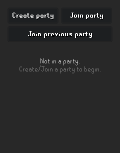
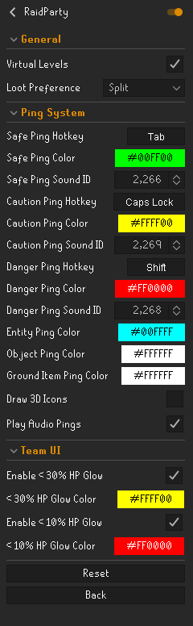
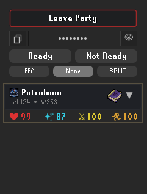
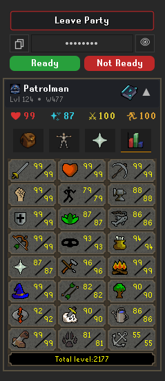
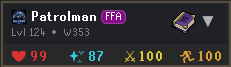
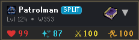
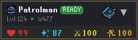
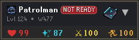
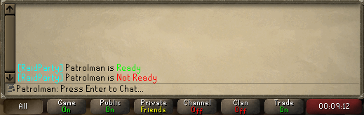

# RaidParty

  
  
  

RaidParty is a RuneLite party plugin built for raid teams that want more visibility, faster communication, and better in-raid decision support. It expands the standard party experience with a dedicated team panel, shared player-state syncing, ready checks, loot-rule visibility, raid stat overlays, and a ping system designed for high-tempo PvM.

The plugin is aimed at coordinated groups running content such as Tombs of Amascut, Chambers of Xeric, and Theatre of Blood, while remaining useful anywhere a party wants better shared awareness; such as in the wilderness.

---

## Features

### Party Management
- Create a new party or join an existing one with a passphrase
- Rejoin your previous party quickly
- Copy or reveal the active passphrase from within the panel
- Dedicated side-panel workflow built for group setup and fast re-entry

### Team Visibility
- Live party roster with expandable player cards
- Inspection tabs for **inventory**, **equipment**, **prayers**, and **skills**
- Synced combat-relevant information including health, prayer, run energy, world, and spellbook state
- Optional virtual level display for shared stat visibility

### Ready Checks / Loot Preferences
- One-click **Ready / Not Ready** state sharing
- Party-wide loot rule broadcast support for **FFA**, **Split**, or **Unspecified**
- Cleaner pre-raid coordination without relying on chat spam

### Ping System
- **Safe**, **Caution**, and **Danger** pings
- Configurable hotkeys, colors, and sound IDs
- Ground, NPC, object, and item-target awareness
- Optional floating 3D text/icons for higher visibility in cluttered encounters

### Raid Overlays
- Tombs of Amascut point tracking
- Chambers of Xeric point tracking
- On-screen overlay for party points and estimated unique chance information
- Low-HP teammate glow effects for quick visual communication

### Built for active development
- Gradle-based project structure
- Java 11 target
- Straightforward local build and test workflow for RuneLite plugin development

---

## Preview

### Main Plugin Panel

### Settings Panel

### Party Roster

### Player Inspection

### Player Card FFA (Free For All)

### Player Card Split

### Player Card "Ready"

### Player Card "Not Ready"

### In-Game Chat Plugin Response

---

## Why RaidParty

RuneLite's base party tooling is useful, but raid groups often need more immediate context than a simple roster can provide. RaidParty focuses on practical team coordination:

- who is ready
- what spellbooks are being used
- what loot rules are being used
- what gear and supplies teammates have available
- who is in trouble
- what the current raid performance looks like
- where attention needs to shift right now

The goal is not just more data. The goal is faster decisions with less friction.

---

## Configuration highlights

RaidParty includes configurable options for:
- safe, caution, and danger ping hotkeys
- ping colors and sound effects
- 3D ping icon rendering
- low-HP and critical-HP teammate glow effects
- loot preference broadcasting
- virtual level display

This allows teams to keep the core workflow consistent while tailoring the visual and audio feedback to personal preference.

---

## Credits and Acknowledgements

RaidParty incorporates or adapts work from the following projects:

- **TheStonedTurtle – Hub Party Panel**  
  Party panel UI and player sync concepts adapted under BSD-2-Clause.  
  See `LICENSE-THESTONEDTURTLE`.

- **LlemonDuck – Tombs of Amascut Plugin**  
  ToA point tracking and unique chance math adapted under BSD-2-Clause.  
  See `LICENSE-LLEMONDUCK`.

Please retain attribution and the included license files where applicable.

---

## Status

RaidParty is under active development. Features, UI, and media may continue to evolve as the plugin is refined.

---

## Community

Questions, feedback, and collaboration are welcome.

**Join the Discord:** [discord.gg/bosscape](https://discord.gg/bosscape)
**Email:** contact@bosscape.com

---

## License

This repository contains original work as well as components derived from third-party BSD-licensed projects. Review the included license files before redistribution or reuse.
